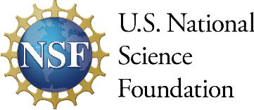

# The KnowLedger Project

 
**NSF Award # 2437951**

The repository provides information about the NSF funded KnowLedger project 
"EAGER: CI PAOS: KnowLedger: An Open Digital Notebook for Research Data Management".

As of January 2, 2025 this repository is no longer being used to promote this project. This content has been moved to the 
following website [https://KnowLedgerDRM.github.io](https://knowledgerdrm.github.io) and GitHub repository 
[https://github.com/KnowLedgerDRM/KnowLedgerDRM.github.io](https://github.com/KnowLedgerDRM/KnowLedgerDRM.github.io)

**Stuart Chalk, KnowLedger Project PI** &bullet;
[schalk@unf.edu](mailto:schalk@unf.edu) &bullet;
[ORCID](https://orcid.org/0000-0002-0703-7776)

## Licensing
This work is licensed under a
[Creative Commons Attribution-ShareAlike 4.0 International License][cc-by-sa].

[cc-by-sa]: http://creativecommons.org/licenses/by-sa/4.0/
